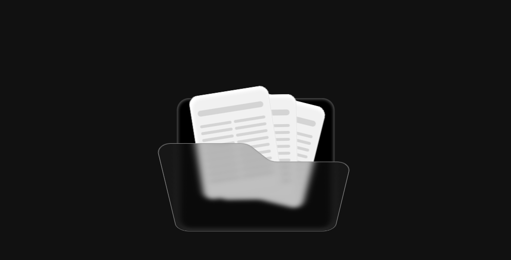
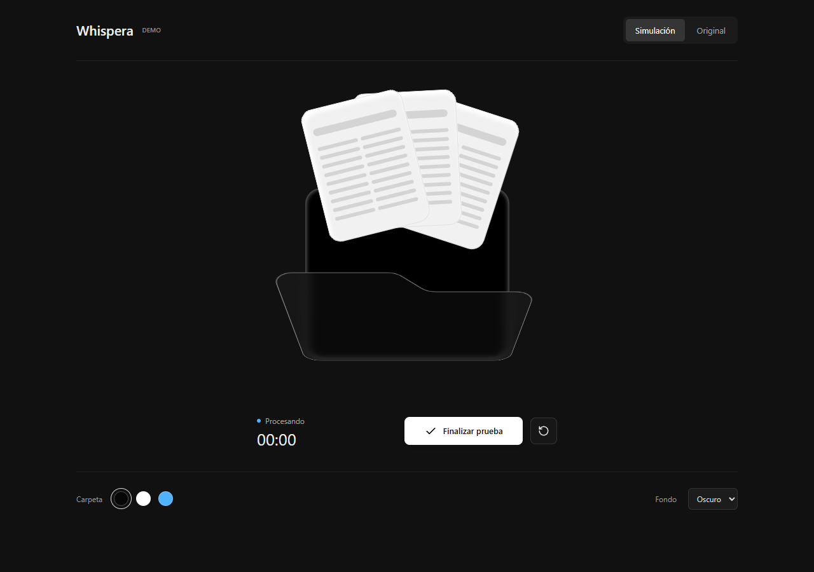
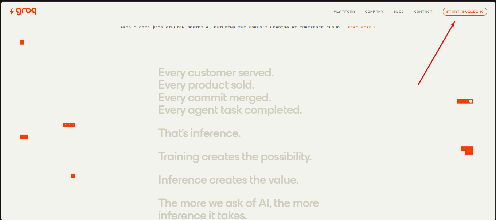
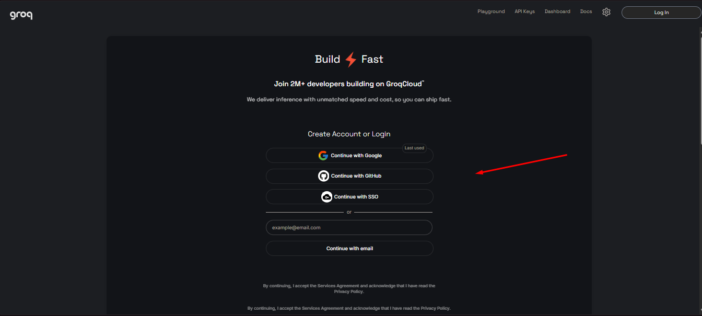
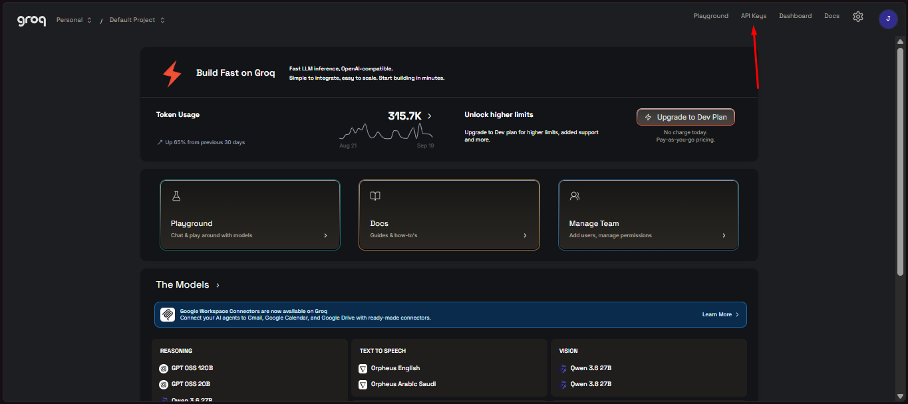
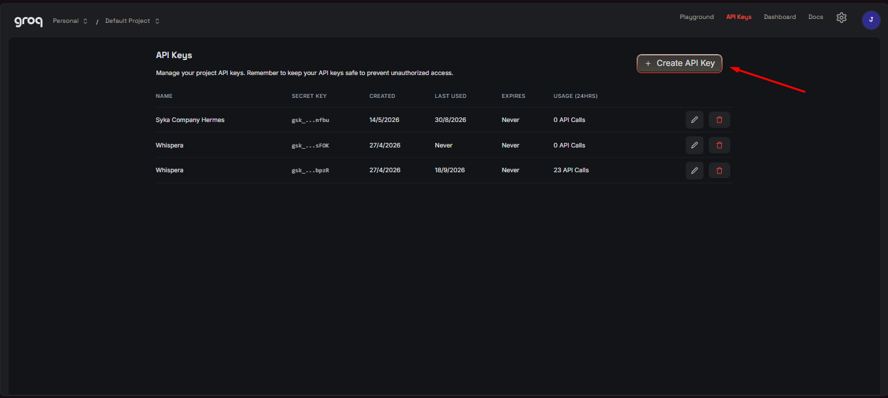
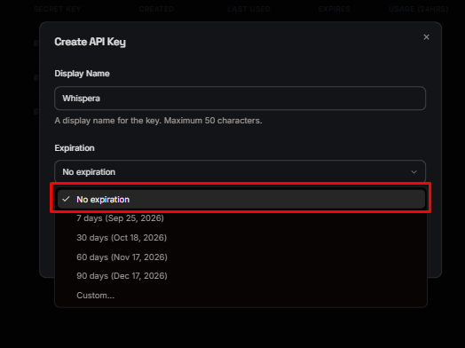

<p align="center">
  
</p>

<h1 align="center">Whispera</h1>

<p align="center">
  Voice dictation, screenshots and screen recording for Windows.<br/>
  Custom shortcuts, region annotations and clipboard output.
</p>

<p align="center">
  <a href="https://github.com/SikJa/Whispera/releases"><kbd>⬇ Download</kbd></a>&ensp;·&ensp;
  <a href="README.md">Español</a>&ensp;·&ensp;
  <a href="https://console.groq.com/keys">Get a Groq key</a>&ensp;·&ensp;
  <a href="docs/PRIVACY.md">Privacy</a>
</p>

---

<p align="center">
  
  &emsp;
  
</p>

## What is it?

**Whispera 0.2.1** unifies dictation, clipboard history, screenshots and screen recording.
This update also integrates work from the
[Whispera-K fork](https://github.com/kazu00001/Whispera-K), preserving its history and credits.
Whispera remains MIT-licensed; third-party components retain their own licenses.

Whispera is a Windows desktop app that turns your voice into text using [Groq](https://groq.com).
It shows up as a **transparent floating folder** on top of any window. Record, transcribe, and auto-paste — all from a keyboard shortcut.

- 🎙️ **No local models** — uses the Groq API (Whisper Large V3 Turbo)
- 🔑 **Your own key** — no Whispera account, no server of ours
- 🪟 **Native on Windows** — Tauri + Rust + React, with FFmpeg included for video
- 🌐 **Spanish & English** — interface, installer and setup wizard are bilingual

## Features

| | |
|---|---|
| 🎨 **Customizable folder** | Color, scale, control placement, animations |
| ⏸️ **Pause & cancel** | With confirmation and system audio restore |
| 📂 **Transcribe files** | Open an audio file and transcribe it without recording |
| 📖 **Personal dictionary** | Names and terms the recognizer should respect |
| 📋 **History** | Every transcription, editable and copyable |
| 🔊 **Sounds** | Custom start/stop themes (cristal, marimba, pop…) |
| 💾 **Recovery** | Audio saved progressively, per-segment retries |
| 🚀 **Start with Windows** | Launches hidden in the system tray |
| 🎬 **Region video** | Select, record and finish with the same shortcut or Escape; MP4/H.264 at 30 FPS |
| 🖼️ **PNG screenshots** | Native lossless resolution; edit or copy immediately on release |
| ✏️ **Annotations** | Pen, line, arrow, rectangle, highlighter, text and rounded blur; undo/redo |
| ⌨️ **Press-to-set shortcuts** | Dictation, screenshots and video together in Shortcut settings |
| 🔈 **Video audio** | None, system, microphone or both; saved as your preference |
| 🕘 **Recent captures** | Copy any of the last 12 results again from History |
| ⏯️ **Video controls** | Pause, resume and discard; fixed side tools and controls below the capture |

The capture frame defaults to white and has its own color setting. The folder
hides after completed dictation even if no paste target was available. Edits
to past transcriptions can be saved.

Initial setup includes the illustrated Groq key guide. Its setup entry disappears
after completion; all regular preferences remain available in Settings.

MP4 is copied as a file: **Ctrl+V** works in destination apps that accept file
pasting. A local temporary copy keeps the clipboard valid.
[Screenshot and video guide, in Spanish](docs/SCREEN_RECORDING.md).

## Install

1. Download `Whispera_*_x64-setup.exe` from [Releases](https://github.com/SikJa/Whispera/releases)
2. Install for your user — no admin rights needed
3. First launch opens a **4-step setup wizard**:

| Step | What you do |
|:---:|---|
| 🛡️ | **Privacy** — Review how your audio and data are handled |
| 🔑 | **Groq** — Create your key at [console.groq.com/keys](https://console.groq.com/keys) and validate it |
| 🎤 | **Preferences** — Choose microphone, language, shortcut and auto-paste |
| ✅ | **Ready** — Whispera minimizes to the tray, ready to dictate |

4. Click a text field, press `Ctrl+Shift+Space`, speak, and press again

---

### 🔑 How to get your Groq key (step by step)

<details>
<summary>See guide with screenshots</summary>

<br/>

**Step 1 — Create a Groq account**

Go to [console.groq.com](https://console.groq.com) and sign up with Google or your email. It's free.



<br/><br/>

**Step 2 — Go to API Keys**

Once logged in, click **API Keys** in the navigation menu.



<br/><br/>

**Step 3 — Create a new key**

Click the **Create API Key** button.



<br/><br/>

**Step 4 — Name your key**

Type a name for your key (e.g. "Whispera") and confirm.



<br/><br/>

**Step 5 — Copy the key**

Your key is shown only once. Copy it and paste it in Whispera. It starts with `gsk_`.



<br/><br/>

> ⚠️ **Important:** the key is not shown again. If you lose it, create a new one.

</details>

---

## What each user configures

Version 0.2.0 adds a unified clipboard library (text, links, images, videos and
files), native drag, search, groups, pins, retention controls and its own shortcut.
The image editor combines captures on a canvas with original backgrounds, blur,
custom colors, padding, corners and shadows. Capture uses native in-memory frames,
preserves open menus, adds compact Line tools and more shapes, and supports PNG
snapshots during video. Video controls disappear while finalization runs in the
background. Long dictation can transcribe completed chunks while you keep talking.

Optional microphone transcription adds a TXT companion to videos. Whether a target
app inserts that text inline depends on which clipboard/drop formats it accepts.
See [release notes and limitations](docs/releases/0.2.0.md).

| Setting | Required? | Details |
|---|:---:|---|
| **Groq API key** | Yes | Stored in Windows Credential Manager, never in files |
| **Microphone** | — | Uses the Windows default; check permissions |
| **Shortcut** | — | `Ctrl+Shift+Space` by default, customizable |
| **Audio language** | — | Spanish by default; English, Portuguese or auto |
| **Auto-paste** | — | Enabled by default; you can copy-only instead |
| **Start with Windows** | — | Optional, launches in the tray |
| **Dictionary** | — | Starts empty; add your words later |
| **Color & sounds** | — | Optional, several built-in themes |

## Privacy

- Audio and dictionary vocabulary are sent to **Groq** when transcribing (HTTPS)
- Your key is stored in **Windows Credential Manager**, not in text files
- Local data stays in `%APPDATA%\app.whispera.desktop.preview` and `%LOCALAPPDATA%\app.whispera.desktop.preview`
- **No Whispera server** — no analytics, no telemetry, no account
- Completed/cancelled audio and eligible history expire after 48 hours. The library
  has separate retention settings and preserves pins. Use incognito for sensitive content.

More → [docs/PRIVACY.md](docs/PRIVACY.md)

## Development

Requirements: Windows, Node.js 22+, Rust stable (MSVC), C++ Build Tools, WebView2.

```bash
cd apps/desktop
npm ci
npm ci --ignore-scripts --prefix vendor/edge-drop
npm run build          # includes the clipboard renderer
npm run desktop        # dev with hot-reload
```

```bash
npm run tauri build -- --bundles nsis    # generate installer
cd src-tauri && cargo test --locked      # Rust tests
```

The installer is generated at `src-tauri/target/release/bundle/nsis/`.

After building, run `npx playwright install chromium` and `npm run test:release`.
The suites use an isolated server, silent headless browsers, synthetic media and
mocked native IPC. Real microphone/paste checks are separate opt-in tests.

## License

MIT — see [LICENSE](LICENSE).
Third-party attributions at [THIRD_PARTY_NOTICES.md](THIRD_PARTY_NOTICES.md).
