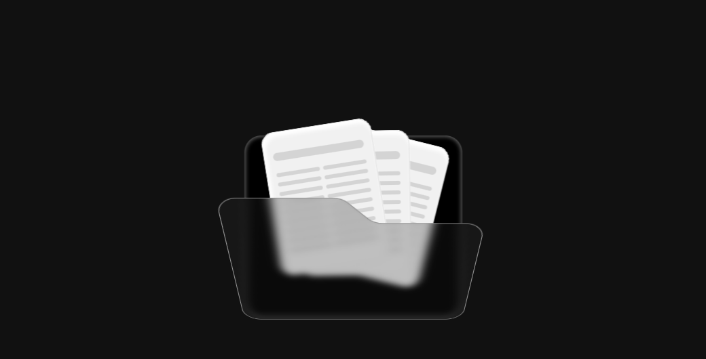
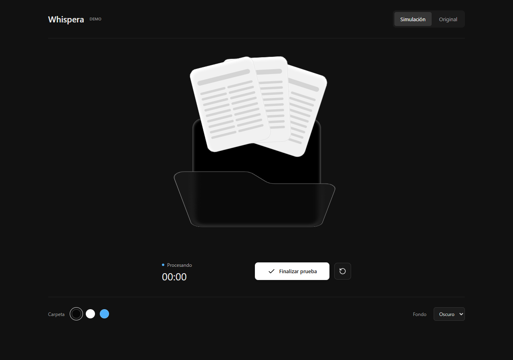
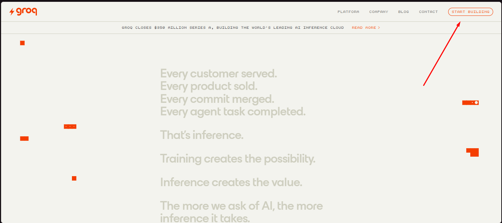
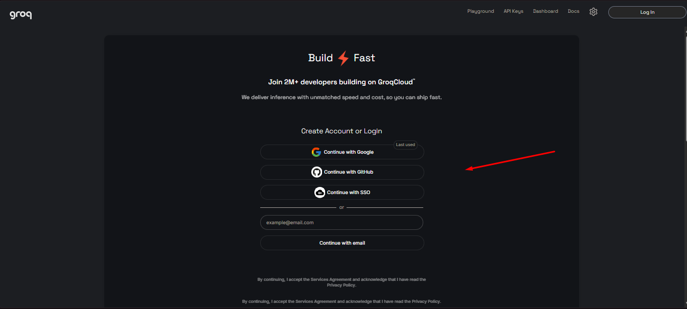
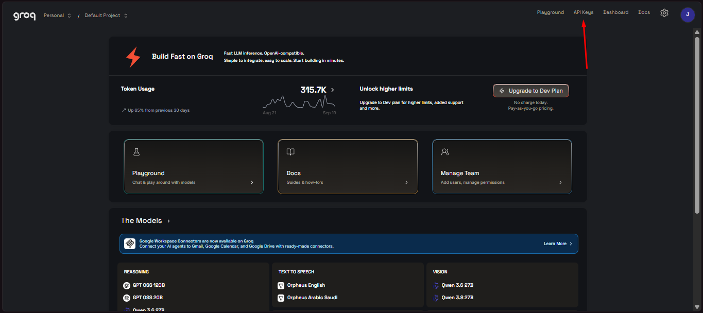
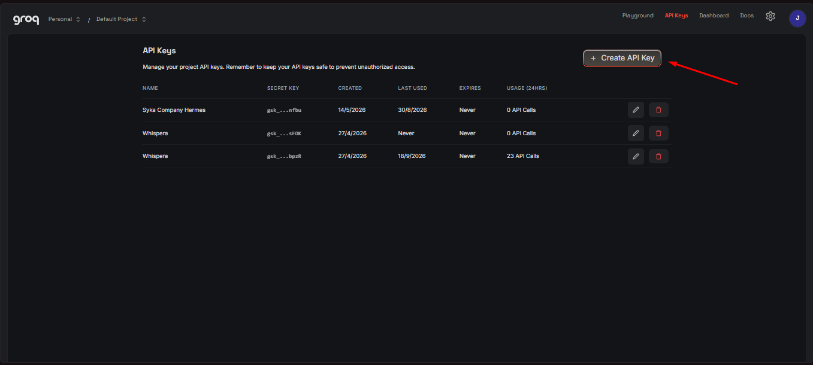
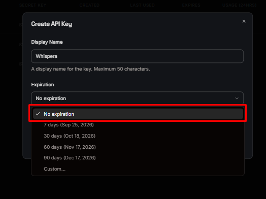

<p align="center">
  
</p>

<h1 align="center">Whispera</h1>

<p align="center">
  Dictado por voz flotante para Windows.<br/>
  Pulsá un atajo, hablá, y el texto se pega donde lo necesites.
</p>

<p align="center">
  <a href="https://github.com/SikJa/Whispera/releases"><kbd>⬇ Descargar</kbd></a>&ensp;·&ensp;
  <a href="README.en.md">English</a>&ensp;·&ensp;
  <a href="https://console.groq.com/keys">Obtener clave Groq</a>&ensp;·&ensp;
  <a href="docs/PRIVACY.md">Privacidad</a>
</p>

---

<p align="center">
  
  &emsp;
  
</p>

## ¿Qué es?

Whispera es una app de escritorio para Windows que convierte tu voz en texto usando [Groq](https://groq.com).
Aparece como una **carpeta flotante transparente** sobre cualquier ventana. Grabás, transcribe, y pega el resultado automáticamente — todo desde un atajo de teclado.

- 🎙️ **Sin modelos locales** — usa la API de Groq (Whisper Large V3 Turbo)
- 🔑 **Tu propia clave** — sin cuenta de Whispera, sin servidor nuestro
- 🪟 **Nativo en Windows** — Tauri + Rust + React, ~6 MB de instalador
- 🌐 **Español e inglés** — interfaz, instalador y guía inicial bilingüe

## Características

| | |
|---|---|
| 🎨 **Carpeta personalizable** | Color, escala, posición de controles, animaciones |
| ⏸️ **Pausa y cancelación** | Con confirmación y restauración del audio del sistema |
| 📂 **Transcribir archivos** | Abrí un audio desde el explorador y transcribilo sin grabar |
| 📖 **Diccionario personal** | Nombres y términos que el reconocimiento tiene que respetar |
| 📋 **Historial** | Todas tus transcripciones, editables y copiables |
| 🔊 **Sonidos** | Temas de inicio/fin personalizables (cristal, marimba, pop…) |
| 💾 **Recuperación** | Audio guardado progresivamente, reintentos por fragmento |
| 🚀 **Inicio con Windows** | Arranca oculto en la bandeja del sistema |

## Instalar

1. Descargá `Whispera_*_x64-setup.exe` desde [Releases](../../releases)
2. Instalá para tu usuario — no necesita permisos de administrador
3. La primera vez se abre una **guía de configuración** de 4 pasos:

| Paso | Qué hacés |
|:---:|---|
| 🛡️ | **Privacidad** — Revisás cómo se maneja tu audio y tus datos |
| 🔑 | **Groq** — Creás tu clave en [console.groq.com/keys](https://console.groq.com/keys) y la validás |
| 🎤 | **Preferencias** — Elegís micrófono, idioma, atajo y pegado automático |
| ✅ | **Listo** — Whispera se minimiza a la bandeja, lista para dictar |

4. Hacé clic en un campo de texto, pulsá `Ctrl+Shift+Space`, hablá, y pulsá de nuevo

---

### 🔑 Cómo obtener tu clave de Groq (paso a paso)

<details>
<summary>Ver guía con imágenes</summary>

<br/>

**Paso 1 — Crear una cuenta en Groq**

Andá a [console.groq.com](https://console.groq.com) y registrate con Google o tu email. Es gratis.



<br/><br/>

**Paso 2 — Ir a API Keys**

Una vez adentro, hacé clic en **API Keys** en el menú de navegación.



<br/><br/>

**Paso 3 — Crear una nueva clave**

Hacé clic en el botón **Create API Key**.



<br/><br/>

**Paso 4 — Ponerle un nombre**

Escribí un nombre para identificar tu clave (por ejemplo "Whispera") y confirmá.



<br/><br/>

**Paso 5 — Copiar la clave**

Tu clave aparece una sola vez. Copiala y pegala en Whispera. Empieza con `gsk_`.



<br/><br/>

> ⚠️ **Importante:** la clave no se vuelve a mostrar. Si la perdés, podés crear una nueva.

</details>

---

## Qué configura cada persona

| Ajuste | ¿Obligatorio? | Detalle |
|---|:---:|---|
| **Clave de Groq** | Sí | Se guarda en Windows Credential Manager, nunca en archivos |
| **Micrófono** | — | Usa el predeterminado de Windows; verificá los permisos |
| **Atajo** | — | `Ctrl+Shift+Space` por defecto, personalizable |
| **Idioma del audio** | — | Español por defecto; inglés, portugués o auto |
| **Pegado automático** | — | Activado por defecto; podés solo copiar |
| **Inicio con Windows** | — | Opcional, arranca en la bandeja |
| **Diccionario** | — | Vacío; agregá tus palabras después |
| **Color y sonidos** | — | Opcionales, hay varios temas incluidos |

## Privacidad

- El audio y el vocabulario del diccionario se envían a **Groq** al transcribir (HTTPS)
- La clave se guarda en **Windows Credential Manager**, no en archivos de texto
- Grabaciones, historial y logs quedan en `%APPDATA%\app.whispera.desktop`
- **No hay servidor de Whispera** — sin analytics, sin telemetría, sin cuenta
- Los datos locales **no se borran automáticamente** (incluidos audios cancelados)

Más información → [docs/PRIVACY.md](docs/PRIVACY.md)

## Desarrollo

Requisitos: Windows, Node.js 22+, Rust stable (MSVC), C++ Build Tools, WebView2.

```bash
cd apps/desktop
npm ci
npm run desktop        # dev con hot-reload
```

```bash
npm run tauri build -- --bundles nsis    # generar instalador
cd src-tauri && cargo test --locked      # tests de Rust
```

El instalador se genera en `src-tauri/target/release/bundle/nsis/`.

## Licencia

MIT — ver [LICENSE](LICENSE).
Atribuciones de terceros en [THIRD_PARTY_NOTICES.md](THIRD_PARTY_NOTICES.md).
